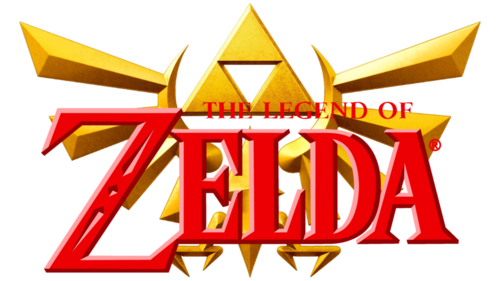
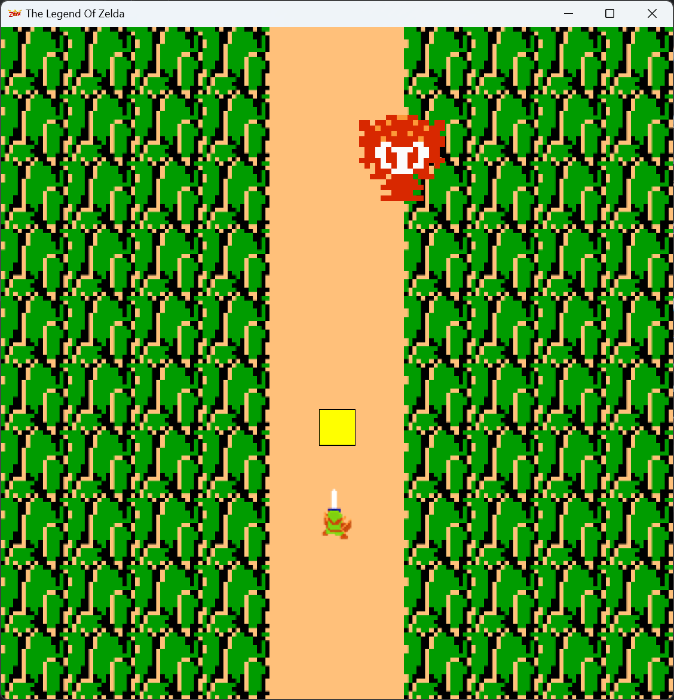

By Dean Tumabcao & Alan for a high school final project. A FINAL. Coded with Java, procrastination, sketchy ideas and love. Uploaded to GitHub for archival.

# Version 1.0.0 UNFINISHED

## About
A 2D top-down adventure video game where you can swing a sword and walk around.
### 🎞️ Trailer

https://github.com/dtumabcaofhs/TLOZ_Unfinished/assets/143454140/815b1504-10f1-46df-b9c7-d9de55bdaf54

### 📷 Screenshots

### 📖 The Legend Of Zelda Guide
#### 👋 Introduction
Welcome to **The Legend Of Zelda**! This video game is unfinished.
#### ❓ How To Link
* ⬇️↙️⬇️⬅️ Use 'WASD' to move Link.
* ⚔️ Press 'Z' to pull out your sword.

#### Try your luck and don't get stuck! 😏 (you probably will)
